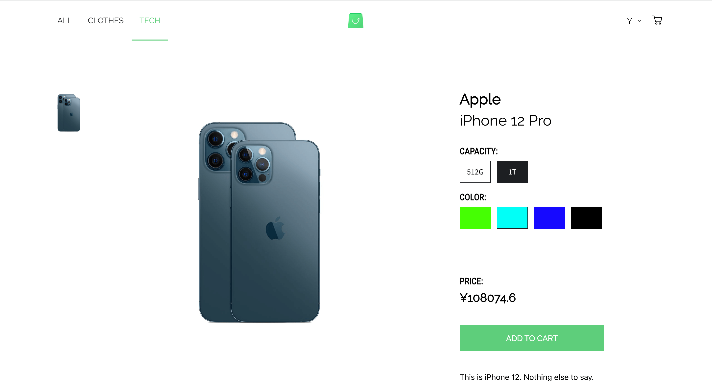

# react-code-challenge

An E-commerce web app built with ReactJs and GraphQL 
[https://ridwan-ecommerce.netlify.app/](https://ridwan-ecommerce.netlify.app/)

## Project Description

Fetch data from the GraphQL endpoint and provide an interface to view and interact with this data. You can find the endpoint [here](https://github.com/scandiweb/junior-react-endpoint), along with instructions on how to launch it.

<span>
 
 
 


 
</span>


## Requirements

- The solution should get implemented as per design, which is available at [this link](https://www.figma.com/file/MSyCAqVy1UgNap0pvqH6H3/Junior-Frontend-Test-Designs-Public?node-id=0%3A1).
- Written with React
- Components should be written in Class components.
- Create-react-app to scaffold the application.

## Installation

1. Fork or Clone the repository, then set it up:

```bash
$ cd react-code-challenge
$ yarn install
```

## How to run the Project

1. Go to this [link](https://github.com/scandiweb/junior-react-endpoint) to clone the `GraphQL` backend API
2. Follow the instructions on the page to start terminal
3. Open the project folder and run `yarn start`

## `src` Folder Structure

```
.
├── README.md
├── package.json
├── public
│   ├── favicon.ico
│   ├── index.html
│   ├── logo192.png
│   ├── logo512.png
│   ├── manifest.json
│   └── robots.txt
├── src
│   ├── App.js
│   ├── assets
│   ├── components
│   ├── graphql
│   ├── index.css
│   ├── index.js
│   ├── navigation
│   ├── pages
│   ├── reportWebVitals.js
│   ├── setupTests.js
│   ├── styles.js
│   └── utils
└── yarn.lock

8 directories, 15 files
```

## Problem Statements

See some more specific information on the main requirements below. Remember - if something is in the design, but is not explicitly described here or above, it should be implemented anyways.

- Ability to add/remove products and change their amounts in cart - on the cart page itself, PLP and PDP should be provided.
- For products that have various options (attributes) - the options should be selected.
- The selected options of added to cart products should be visible in cart overlay and in cart page.
- If an attribute is a swatch attribute (type = swatch), a representation of the value should be rendered on PDP and PLP, rather than text description (e.g. the color itself, not "Blue" or "0000FF")
- Filtering products by category name for all of the categories from BE
- The descriptions provided in HTML format should be parsed and presented as HTML, not as plain text
- Ability to change the currency of the store to one of the available currencies

## Technologies Used

- `apollo-boost` - makes Apollo-client configuration easy and also to manage global state in order to minimize 3rd party libraries such as `redux`.
- `apollo-cache-persist` - used to persist global state.
- `react-router-dom` - used for routing from one screen to another.
- `styled-components` - used for CSS styling.
